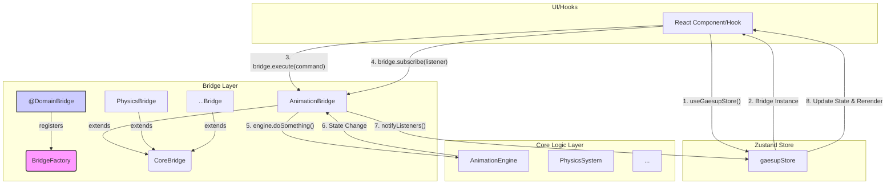

# 브릿지 패턴 리팩토링 가이드

## 1. 개요

본 문서는 프로젝트 내에서 사용되는 '브릿지(Bridge)' 패턴을 표준화하고, 기존의 비표준 브릿지(`InteractionBridge`, `WorldBridge`)를 리팩토링하기 위한 가이드입니다. 일관된 아키텍처를 적용하여 코드의 예측 가능성을 높이고 유지보수 비용을 절감하는 것을 목표로 합니다.

## 2. 표준 브릿지 아키텍처

표준 브릿지는 특정 도메인(애니메이션, 물리, 모션 등)의 핵심 로직(`System` 또는 `Engine`)을 감싸고, 외부 시스템(UI, 훅 등)과의 상호작용을 위한 일관된 인터페이스를 제공하는 파사드(Facade) 역할을 합니다. 모든 표준 브릿지는 `BridgeFactory`를 통해 싱글톤으로 관리됩니다.

### 주요 구성 요소

- **`BridgeFactory`**: 모든 브릿지 인스턴스를 생성하고 관리하는 팩토리 클래스입니다. `create(domain)` 또는 `get(domain)`을 통해 브릿지 인스턴스를 가져옵니다.
- **`@DomainBridge(domain: string)`**: 브릿지 클래스를 `BridgeFactory`에 등록하는 클래스 데코레이터입니다.
- **`CoreBridge<Engine, Snapshot, Command>`**: 모든 표준 브릿지가 상속받는 추상 클래스입니다. `Engine` 관리, `execute`/`snapshot` 메서드, 구독/알림 시스템 등 공통 기능을 제공합니다.
- **`*System` 또는 `*Engine`**: 도메인의 실제 로직을 포함하는 핵심 클래스입니다. 브릿지는 이 클래스의 퍼사드 역할을 합니다.
- **`Command` / `Snapshot`**: 브릿지와 상호작용하기 위한 데이터 구조입니다. `Command`는 브릿지에 작업을 지시하고, `Snapshot`은 브릿지로부터 현재 상태를 받아오는 데 사용됩니다.

### 데이터 흐름



1.  UI(훅, 컴포넌트)는 `useGaesupStore`를 통해 브릿지 인스턴스를 가져옵니다.
2.  사용자 입력 등에 따라 `bridge.execute(command)`를 호출하여 `Engine`에 작업을 지시합니다.
3.  상태 변경을 구독하기 위해 `bridge.subscribe(listener)`를 사용합니다. `listener`는 보통 `zustand`의 `set` 함수와 연결됩니다.
4.  `Engine` 내부에서 상태가 변경되면, 브릿지의 `notifyListeners()`가 호출됩니다.
5.  `notifyListeners()`는 `zustand`의 `set` 함수를 실행하여 스토어 상태를 업데이트하고, 관련된 UI를 리렌더링합니다.

## 3. 리팩토링 절차

비표준 브릿지를 표준 패턴으로 리팩토링하는 절차는 다음과 같습니다.

### 1단계: 브릿지 클래스 구조 변경

- 비표준 브릿지 클래스가 `CoreBridge<Engine, Snapshot, Command>`를 상속하도록 수정합니다.
- 제네릭 타입에 맞는 `Engine`, `Snapshot`, `Command` 타입을 정의합니다.
- 클래스 상단에 `@DomainBridge('your-domain-name')` 데코레이터를 추가합니다.

**예시: `InteractionBridge.ts`**

```typescript
// 이전
export class InteractionBridge { ... }

// 이후
import { CoreBridge, DomainBridge } from '@core/boilerplate';
import { InteractionSystem } from '../core/InteractionSystem';
import { InteractionSnapshot, InteractionCommand } from './types';

@DomainBridge('interaction')
export class InteractionBridge extends CoreBridge<
  InteractionSystem,
  InteractionSnapshot,
  InteractionCommand
> { ... }
```

### 2단계: `buildEngine` 구현

- `CoreBridge`의 추상 메서드인 `buildEngine`을 구현합니다.
- 이 메서드는 `Engine`(`*System`) 인스턴스를 생성하고 반환합니다.
- `zustand` 스토어와 동기화가 필요하다면, `buildEngine`의 파라미터로 `zustand`의 `set` 함수나 상태(`config`)를 받아 `Engine`에 주입합니다.

**예시: `InteractionBridge.ts`**

```typescript
// ...
import { InteractionState } from '@/core/stores/slices/interaction/types';

// ...
  protected buildEngine(id: string, initialState: InteractionState): InteractionSystem | null {
    const engine = new InteractionSystem(initialState);
    
    // Engine의 상태 변경을 zustand에 알리기 위한 구독 설정
    engine.subscribe((newState) => {
      // 여기서 zustand의 set 함수를 호출해야 함
      // 이 로직은 CoreBridge의 notifyListeners와 통합될 수 있음
      console.log('New state from engine:', newState);
    });

    return engine;
  }
// ...
```

### 3단계: `executeCommand` 및 `createSnapshot` 구현

- 기존의 public 메서드들을 `executeCommand`와 `createSnapshot` 로직으로 통합합니다.

**`executeCommand`**:
- 외부의 명령을 받아 해당하는 `Engine`의 메서드를 호출합니다.

```typescript
// ...
  @ValidateCommand()
  protected executeCommand(engine: InteractionSystem, command: InteractionCommand, id: string): void {
    switch (command.type) {
      case 'updateMouse':
        engine.updateMouse(command.data);
        break;
      case 'updateKeyboard':
        engine.updateKeyboard(command.data);
        break;
      // ... other cases
    }
  }
// ...
```

**`createSnapshot`**:
- 현재 `Engine`의 상태를 요약한 `Snapshot` 객체를 반환합니다.

```typescript
// ...
  @LogSnapshot()
  protected createSnapshot(engine: InteractionSystem, id: string): InteractionSnapshot {
    return engine.getState(); // Engine에 getState() 메서드가 있다고 가정
  }
// ...
```

### 4단계: `zustand` 스토어와 통합

- `gaesupStore.ts`에서 `BridgeFactory.create(domain)`를 사용하여 새로운 브릿지를 생성합니다.
- 이때, 브릿지의 `buildEngine`에 필요한 초기 상태(`config`)와 `set` 함수를 전달하여 상태 동기화가 이루어지도록 설정합니다.

**예시: `gaesupStore.ts`**

```typescript
// ...
import { BridgeFactory } from '@core/boilerplate';
import { InteractionBridge } from '@core/interactions/bridge/InteractionBridge';
// ...

// 스토어 생성자 또는 초기화 로직 내부
const interactionBridge = BridgeFactory.create<InteractionBridge>('interaction');
if (interactionBridge) {
  interactionBridge.register('default', get().interaction); // 'default' 엔진 등록
  
  // 브릿지에서 상태 변경이 있을 때 스토어를 업데이트하도록 구독
  interactionBridge.subscribe('default', (snapshot) => {
    set((state) => ({ 
      interaction: { ...state.interaction, ...snapshot }
    }));
  });
}
```

### 5단계: 기존 코드 수정

- `new YourBridge()` 또는 `YourBridge.getInstance()`를 사용하던 모든 코드를 `useGaesupStore`를 통해 브릿지 인스턴스를 가져오도록 수정합니다.
- 브릿지의 public 메서드를 직접 호출하던 부분을 `bridge.execute(command)` 또는 `bridge.snapshot()`으로 변경합니다.

---
이 가이드를 따라 `InteractionBridge`와 `WorldBridge`를 리팩토링하면 프로젝트의 모든 브릿지가 일관된 패턴을 갖게 되어 코드 베이스의 전반적인 품질이 향상될 것입니다. 