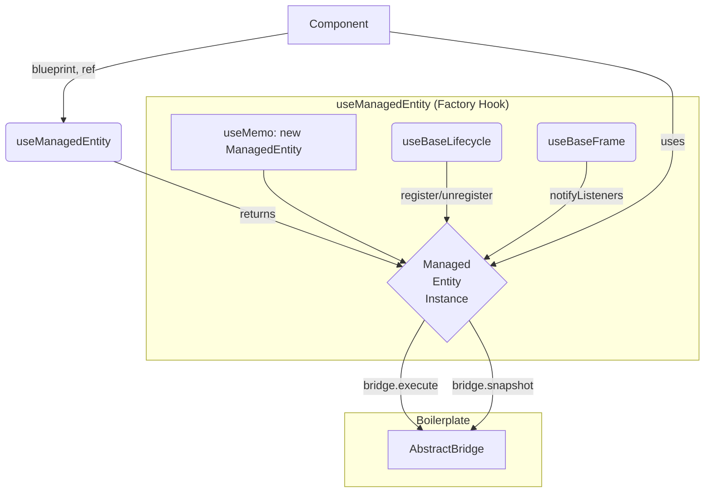

# Boilerplate 아키텍처 가이드

이 문서는 `src/core/boilerplate`에 위치한 파일들이 어떻게 상호작용하여 재사용 가능한 아키텍처 패턴을 만드는지 설명합니다.

## 1. 핵심 목표

- **도메인 독립성**: `boilerplate`는 특정 도메인(모션, 애니메이션 등)에 대한 지식이 전혀 없습니다.
- **재사용성**: 어떤 도메인이든 이 "틀"을 가져다 구체적인 구현체를 만들 수 있습니다.
- **최소한의 코드**: 개발자가 반복적으로 작성해야 할 코드를 최소화합니다.

## 2. 구성 요소

`boilerplate`는 4개의 핵심 파일로 구성됩니다.

1.  **`AbstractBridge.ts` (추상 설계도)**
    -   **역할**: Layer 1(`ref`)과 Layer 2(`state`) 사이의 통신 채널에 대한 **추상 클래스**입니다.
    -   **특징**: 제네릭(`EngineType`, `SnapshotType`, `CommandType`)을 사용하여 어떤 종류의 엔진/ref, 데이터 타입과도 작동할 수 있습니다. `register`, `unregister`, `subscribe` 등 공통 로직만 구현되어 있고, `execute`와 `snapshot`은 각 도메인에서 구체적으로 구현해야 합니다.

2.  **`ManagedEntity.ts` (관리 객체)**
    -   **역할**: `AbstractBridge`를 통해 특정 `ref` 객체를 관리하는 **제네릭 유틸리티 클래스**입니다.
    -   **특징**: `bridge.register`, `bridge.execute` 등을 호출하는 반복적인 로직을 캡슐화합니다. 컴포넌트나 훅은 이 클래스의 인스턴스를 통해 브릿지와 상호작용합니다.

3.  **`useBaseLifecycle.ts` (생명주기 훅)**
    -   **역할**: `useEffect`를 사용하여 컴포넌트의 `mount`/`unmount` 시점에 브릿지에 `ref`를 등록/해제하는 로직을 담당합니다.
    -   **특징**: 이 로직은 거의 모든 엔티티에서 동일하므로, 재사용을 위해 분리되었습니다.

4.  **`useBaseFrame.ts` (프레임 훅)**
    -   **역할**: `useFrame`을 사용하여 매 프레임마다 브릿지에 "상태를 업데이트하고 구독자에게 알려라"(`notifyListeners`)는 신호를 보냅니다.
    -   **특징**: `Zustand` 같은 스토어가 브릿지의 최신 상태를 구독할 수 있도록 합니다.

## 3. 작동 흐름 (팩토리 패턴)

이 모든 요소는 **`useManagedEntity.ts`** 라는 팩토리 훅을 통해 하나로 조합됩니다.

1.  **컴포넌트**는 `useManagedEntity` 훅을 호출합니다.
2.  **`useManagedEntity`**는 내부적으로 `ManagedEntity` 인스턴스를 생성하고(`useMemo`), `useBaseLifecycle`과 `useBaseFrame`을 호출하여 생명주기와 프레임 루프에 필요한 모든 로직을 자동으로 연결합니다.
3.  `useManagedEntity`는 모든 것이 연결된 `ManagedEntity` 인스턴스를 반환합니다.
4.  컴포넌트는 반환된 인스턴스를 사용하여 `execute` 같은 메서드를 호출하며 브릿지와 상호작용합니다.

이 패턴을 통해, 컴포넌트 개발자는 `useEffect`나 `useFrame`의 복잡한 내부 구현을 알 필요 없이 `useManagedEntity` 훅 하나만 사용하면 됩니다. 