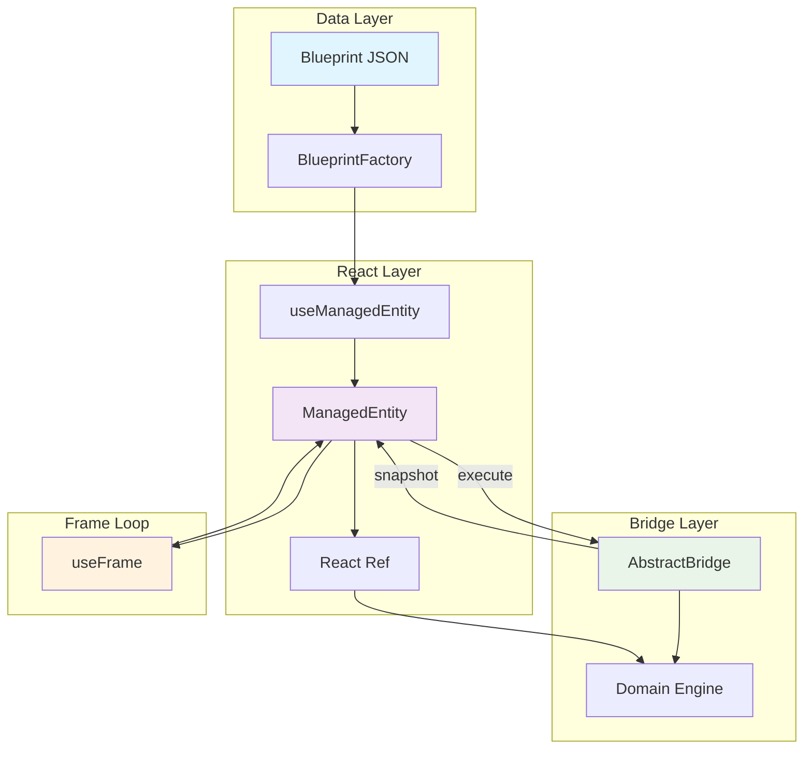

# Boilerplate Architecture - 통합 아키텍처 가이드

이 문서는 `src/core/boilerplate`에 위치한 파일들이 어떻게 상호작용하여 Gaesup World의 **모든 도메인이 공통으로 사용하는 재사용 가능한 아키텍처 패턴**을 만드는지 설명합니다.

**위치**: `src/core/boilerplate/`

## 1. 핵심 목표

- **도메인 독립성**: 특정 도메인(모션, 애니메이션 등)에 대한 지식이 전혀 없습니다.
- **재사용성**: 어떤 도메인이든 이 "틀"을 사용하여 구체적인 구현체를 만들 수 있습니다.
- **최소한의 코드**: 개발자가 반복적으로 작성해야 할 코드를 최소화합니다.
- **성능 최적화**: 프레임 루프와 React 렌더링을 분리하여 60fps 성능을 보장합니다.

## 2. 아키텍처 구조

```
src/core/boilerplate/
├── bridge/              # 브릿지 패턴 구현
│   ├── AbstractBridge.ts      # 추상 브릿지 클래스
│   ├── CoreBridge.ts          # 확장된 브릿지 클래스
│   ├── BridgeFactory.ts       # 브릿지 팩토리
│   └── BridgeRegistry.ts      # 브릿지 등록 시스템
├── entity/              # 엔티티 관리
│   ├── ManagedEntity.ts       # 관리 엔티티 클래스
│   ├── AbstractSystem.ts     # 추상 시스템 클래스
│   └── BaseSystem.ts         # 기본 시스템 클래스
├── hooks/               # 기반 훅들
│   ├── useManagedEntity.ts    # 팩토리 훅
│   ├── useBaseLifecycle.ts   # 생명주기 훅
│   ├── useBaseFrame.ts       # 프레임 훅
│   └── useEntity.ts          # 통합 엔티티 훅
├── decorators/          # 데코레이터 시스템
│   ├── index.ts              # 메인 데코레이터들
│   ├── advanced.ts           # 고급 데코레이터들
│   ├── bridge.ts             # 브릿지 데코레이터들
│   ├── monitoring.ts         # 모니터링 데코레이터들
│   └── system.ts             # 시스템 데코레이터들
├── di/                  # 의존성 주입
│   ├── container.ts          # DI 컨테이너
│   ├── Autowired.ts          # 자동 주입 데코레이터
│   └── ServiceLocator.ts     # 서비스 로케이터
└── types/               # 타입 정의
    ├── index.ts              # 기본 타입들
    └── reflect-metadata.d.ts # 메타데이터 타입
```

## 3. 핵심 구성 요소

### 3.1 AbstractBridge - 추상 브릿지 클래스

**파일**: `src/core/boilerplate/bridge/AbstractBridge.ts`

Layer 1(`ref`)과 Layer 2(`state`) 사이의 통신 채널에 대한 **추상 클래스**입니다. Template Method와 Observer 패턴을 구현합니다.

```typescript
export abstract class AbstractBridge<
  EngineType extends IDisposable,
  SnapshotType,
  CommandType,
> {
  protected engines: Map<string, EngineType>;
  protected snapshots: Map<string, Readonly<SnapshotType>>;
  private eventListeners: Set<(snapshot: SnapshotType, id: string) => void>;
  
  // 공통 기능
  register(id: string, ...args: unknown[]): void
  unregister(id: string): void
  execute(id: string, command: CommandType): void
  snapshot(id: string): Readonly<SnapshotType> | null
  subscribe(listener: Function): () => void

  // 각 도메인에서 구현해야 할 추상 메서드
  protected abstract buildEngine(id: string, ...args: unknown[]): EngineType | null;
  protected abstract executeCommand(engine: EngineType, command: CommandType, id: string): void;
  protected abstract createSnapshot(engine: EngineType, id: string): SnapshotType | null;
}
```

**주요 기능**:
- **엔티티 등록/해제**: `register()`, `unregister()`
- **명령 실행**: `execute()` 
- **상태 스냅샷**: `snapshot()`, `getCachedSnapshot()`
- **이벤트 시스템**: `subscribe()`, `notifyListeners()`
- **미들웨어 지원**: `use()`, 체인 방식 처리

### 3.2 ManagedEntity - 관리 엔티티 클래스

**파일**: `src/core/boilerplate/entity/ManagedEntity.ts`

`AbstractBridge`를 통해 특정 `ref` 객체를 관리하는 **제네릭 유틸리티 클래스**입니다.

```typescript
export class ManagedEntity<EngineType, SnapshotType, CommandType> {
  private bridge: AbstractBridge<EngineType, SnapshotType, CommandType>;
  private id: string;
  private ref: React.RefObject<any>;

  execute(command: CommandType): void
  getSnapshot(): Readonly<SnapshotType> | null
  dispose(): void
}
```

**핵심 역할**:
- **ref 기반 엔티티 관리**: Three.js 객체와 React ref 연결
- **브릿지 인터페이스**: 간단한 API로 복잡한 브릿지 기능 감춤
- **자동 정리**: 컴포넌트 언마운트 시 메모리 누수 방지

### 3.3 useBaseLifecycle - 생명주기 훅

**파일**: `src/core/boilerplate/hooks/useBaseLifecycle.ts`

`useEffect`를 사용하여 컴포넌트의 `mount`/`unmount` 시점에 브릿지에 `ref`를 등록/해제하는 로직을 담당합니다.

```typescript
export function useBaseLifecycle<EngineType>(
  bridge: AbstractBridge<EngineType, any, any>,
  id: string,
  ref: React.RefObject<any>,
  options?: UseBaseLifecycleOptions<EngineType>
): void
```

**특징**: 이 로직은 거의 모든 엔티티에서 동일하므로, 재사용을 위해 분리되었습니다.

### 3.4 useBaseFrame - 프레임 훅

**파일**: `src/core/boilerplate/hooks/useBaseFrame.ts`

`useFrame`을 사용하여 매 프레임마다 브릿지에 "상태를 업데이트하고 구독자에게 알려라"(`notifyListeners`)는 신호를 보냅니다.

```typescript
export function useBaseFrame(
  bridge: AbstractBridge<any, any, any>,
  id: string,
  options?: UseBaseFrameOptions
): void
```

**특징**: `Zustand` 같은 스토어가 브릿지의 최신 상태를 구독할 수 있도록 합니다.

### 3.5 BridgeFactory & Registry

**파일**: `src/core/boilerplate/bridge/BridgeFactory.ts`, `BridgeRegistry.ts`

브릿지 인스턴스의 생성과 관리를 담당하는 팩토리와 레지스트리입니다.

```typescript
export class BridgeFactory {
  static create<T extends AbstractBridge<any, any, any>>(domain: string): T | null
  static get<T extends AbstractBridge<any, any, any>>(domain: string): T | null
  static has(domain: string): boolean
  static listDomains(): string[]
}

// 사용 예시
@DomainBridge('motions')
export class MotionBridge extends CoreBridge<...> { }

const motionBridge = BridgeFactory.get<MotionBridge>('motions');
```

### 3.6 의존성 주입 (DI) 시스템

**파일**: `src/core/boilerplate/di/container.ts`

싱글톤 패턴으로 구현된 의존성 주입 컨테이너입니다.

```typescript
export class DIContainer {
  static getInstance(): DIContainer
  registerService<T>(token: ServiceToken, provider: ServiceProvider<T>): void
  resolve<T>(token: ServiceToken): T
  injectProperties(target: object): void
}

// 데코레이터 사용
@Service('MyService')
export class MyService { }

export class Consumer {
  @Autowired('MyService')
  private myService: MyService;
}
```

## 4. 데이터 흐름 및 작동 원리

### 4.1 팩토리 패턴 - useManagedEntity

이 모든 요소는 **`useManagedEntity.ts`** 라는 팩토리 훅을 통해 하나로 조합됩니다.



**작동 흐름**:
1. **컴포넌트**는 `useManagedEntity` 훅을 호출합니다.
2. **`useManagedEntity`**는 내부적으로 `ManagedEntity` 인스턴스를 생성하고(`useMemo`), `useBaseLifecycle`과 `useBaseFrame`을 호출하여 생명주기와 프레임 루프에 필요한 모든 로직을 자동으로 연결합니다.
3. `useManagedEntity`는 모든 것이 연결된 `ManagedEntity` 인스턴스를 반환합니다.
4. 컴포넌트는 반환된 인스턴스를 사용하여 `execute` 같은 메서드를 호출하며 브릿지와 상호작용합니다.

### 4.2 레이어 분리 아키텍처

```
Layer 3 (UI/Integration)
    ↓ execute commands
Layer 2 (State Management) - useManagedEntity, Bridge
    ↓ manipulate refs
Layer 1 (Core Logic) - Engine, useFrame
```

이 패턴을 통해, 컴포넌트 개발자는 `useEffect`나 `useFrame`의 복잡한 내부 구현을 알 필요 없이 `useManagedEntity` 훅 하나만 사용하면 됩니다.

## 5. 데코레이터 시스템

### 5.1 브릿지 데코레이터
```typescript
@DomainBridge('myDomain')    // 브릿지 등록
@EnableMetrics()             // 메트릭스 활성화
export class MyDomainBridge extends CoreBridge<...> { }
```

### 5.2 메서드 데코레이터  
```typescript
@ValidateCommand()          // 명령 검증
@LogSnapshot()             // 스냅샷 로깅
@CacheSnapshot(16)         // 스냅샷 캐싱
@Profile()                 // 성능 프로파일링
@HandleError()             // 에러 처리
protected executeCommand(...) { }
```

### 5.3 시스템 데코레이터
```typescript
@RegisterSystem('mySystem') // 시스템 등록
@Service('MyService')       // DI 서비스 등록
export class MySystem { }
```

## 6. 사용 패턴

### 6.1 새로운 도메인 구현
```typescript
// 1. 브릿지 정의
@DomainBridge('myDomain')
export class MyDomainBridge extends CoreBridge<MyEngine, MySnapshot, MyCommand> {
  protected buildEngine(id: string, config: MyConfig): MyEngine | null {
    return new MyEngine(config);
  }

  @ValidateCommand()
  protected executeCommand(engine: MyEngine, command: MyCommand): void {
    // 명령 처리 로직
  }

  @LogSnapshot()
  protected createSnapshot(engine: MyEngine): MySnapshot {
    // 스냅샷 생성 로직
  }
}

// 2. 도메인 훅 정의
export function useMyDomain(id: string, config: MyConfig) {
  const ref = useRef<MyEngine>(null);
  const bridge = useMemo(() => BridgeFactory.get<MyDomainBridge>('myDomain'), []);
  
  const entity = useManagedEntity(bridge, id, ref, {
    onInit: (entity) => console.log('Entity initialized:', entity.getId()),
    frameCallback: () => {
      // 매 프레임 실행될 로직
    }
  });

  const performAction = useCallback((data: ActionData) => {
    entity?.execute({ type: 'myAction', data });
  }, [entity]);

  return {
    entity,
    performAction,
    snapshot: entity?.getSnapshot()
  };
}

// 3. 컴포넌트에서 사용
function MyComponent() {
  const myDomain = useMyDomain('entity-1', { setting: 'value' });
  
  return (
    <mesh ref={myDomain.entity?.getRef()}>
      {/* 3D 요소들 */}
    </mesh>
  );
}
```

### 6.2 Blueprint 기반 팩토리
```typescript
const factory = useEntityFactory();
const character = factory.createCharacter(WARRIOR_BLUEPRINT);
```

## 7. 성능 최적화 전략

### 7.1 메모리 최적화
- **지연 생성**: 브릿지는 필요할 때만 생성
- **싱글톤 패턴**: 도메인당 하나의 브릿지 인스턴스
- **자동 정리**: ManagedEntity의 dispose 메서드로 메모리 누수 방지

### 7.2 계산 최적화
- **스냅샷 캐싱**: `@CacheSnapshot` 데코레이터로 중복 계산 방지
- **스로틀링**: `useBaseFrame`에서 프레임 제한 지원  
- **미들웨어 체인**: 효율적인 이벤트 처리

### 7.3 렌더링 최적화
- **레이어 분리**: useFrame 로직과 React 상태 분리
- **ref 기반 업데이트**: React 리렌더링 없이 3D 객체 조작
- **선택적 구독**: 필요한 상태만 구독하여 불필요한 업데이트 방지

## 8. 초기화 과정

**파일**: `src/core/initializeBridges.ts`

```typescript
// 모든 브릿지 import (데코레이터 실행 보장)
import './motions/bridge/MotionBridge';
import './animation/bridge/AnimationBridge';
import './networks/bridge/NetworkBridge';

// 등록된 모든 도메인 브릿지 생성
const domains = BridgeFactory.listDomains();
domains.forEach(domain => {
  if (!BridgeFactory.has(domain)) {
    const bridge = BridgeFactory.create(domain);
    if (bridge) {
      console.log(`${domain} bridge created successfully`);
    }
  }
});
```

## 9. 확장 가이드

### 9.1 새로운 데코레이터 추가
```typescript
export function MyCustomDecorator(options: MyOptions) {
  return function (target: any, propertyKey: string, descriptor: PropertyDescriptor) {
    const originalMethod = descriptor.value;
    descriptor.value = function (...args: unknown[]) {
      // 전처리 로직
      const result = originalMethod.apply(this, args);
      // 후처리 로직
      return result;
    };
  };
}
```

### 9.2 새로운 시스템 클래스 추가
```typescript
export abstract class MyAbstractSystem<
  StateType,
  MetricsType,
  OptionsType = {},
  UpdateArgsType = {}
> extends AbstractSystem<StateType, MetricsType, OptionsType, UpdateArgsType> {
  // 커스텀 공통 로직
}
```

## 10. 모범 사례

1. **브릿지 설계**: 도메인별로 명확한 Command와 Snapshot 타입 정의
2. **성능 고려**: 무거운 계산은 Engine에서, 가벼운 상태 관리는 Bridge에서
3. **타입 안전성**: 제네릭을 적극 활용하여 컴파일 타임 에러 방지
4. **메모리 관리**: 항상 dispose 패턴 사용, useEffect cleanup 함수 활용
5. **테스트 작성**: 각 브릿지와 엔티티에 대한 단위 테스트 필수

이 Boilerplate Architecture는 전체 프로젝트의 견고한 기반을 제공하며, 새로운 도메인 추가 시 최소한의 코드로 강력한 기능을 구현할 수 있게 해줍니다. 